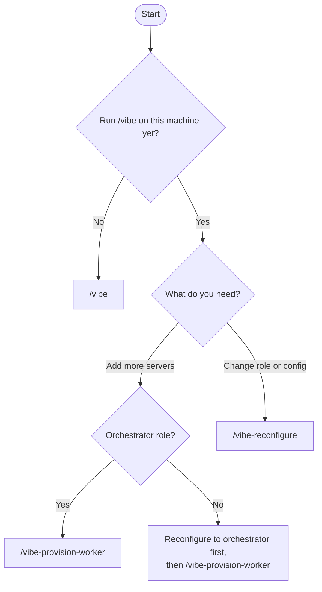
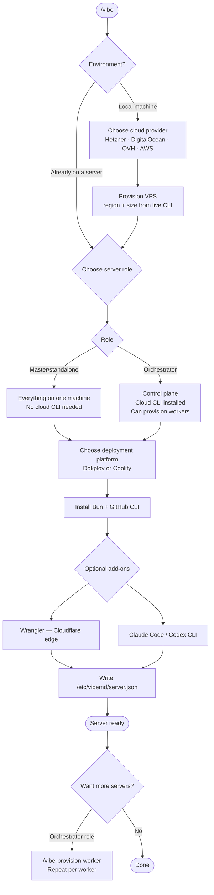
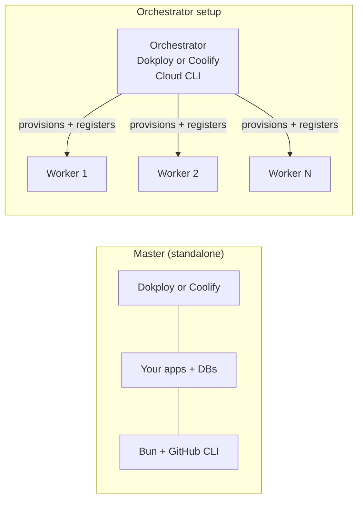

# 🪅 vibe.md

The end-to-end skill for spinning up a 24/7 production-ready full-stack dev and deploy environment. One interview, one clean pass: VPS provisioned, Bun installed, GitHub CLI wired, deployment platform running, and your server ready to ship.

[](https://github.com/amajorai/vibe.md)
[](https://github.com/amajorai/vibe.md)
[](https://github.com/amajorai/vibe.md)
[](https://github.com/amajorai/vibe.md)
[](https://github.com/amajorai/vibe.md/issues)

> [!NOTE]
> These skills have been built and tested with **Claude Code**. Codex support is untested. If you try them on Codex, we'd love your help. [Open an issue](https://github.com/amajorai/vibe.md/issues) to share what works and what doesn't.

## Quickstart

```bash
npx skills add -g amajorai/vibe.md
```

### Update

```bash
# Update this skill
npx skills update vibe

# Update multiple vibe skills
npx skills update vibe vibe-reconfigure vibe-provision-worker

# Update all installed skills (interactive scope prompt)
npx skills update

# Update only global or project skills
npx skills update -g
npx skills update -p

# Non-interactive (auto-detects scope)
npx skills update -y
```

### Claude Code plugin

```
/plugin marketplace add amajorai/vibe.md
/plugin install vibemd@amajorai
```

Invoke as `/vibemd:vibe`, `/vibemd:vibe-reconfigure`, or `/vibemd:vibe-provision-worker`.

## Works great with

- 👻 **[spec.md](https://github.com/amajorai/spec.md)** to spec out everything before building — break any project into atomic GitHub issues so your team always knows what to ship next.
- 📦 **[ship.md](https://github.com/amajorai/ship.md)** to build features with a quality-gated pipeline once your environment is running: explore → plan → implement → verify.
- 🔎 **[fix.md](https://github.com/amajorai/fix.md)** to debug production issues — instruments code with targeted logs, reads them to confirm root cause, and makes a surgical fix.
- 🎉 **[party.md](https://github.com/amajorai/party.md)** to keep building autonomously 24/7. GitHub Projects as your interface; drop in issues and the agent ships them while you sleep.
- 🎬 **[replay.md](https://github.com/amajorai/replay.md)** to record and share live video of your deployed app — auto-detects your vibe server for zero-setup cloud recording.
- 🧪 **[sandbox.md](https://github.com/amajorai/sandbox.md)** to layer self-hosted sandboxes on top of your vibe server — spawn isolated exec environments or dev workspaces without leaving the ecosystem.
- 📋 **[context.md](https://github.com/amajorai/context.md)** to capture what was configured after vibe sets up your server — future agents know the stack without re-exploring from scratch.
- ⚡ **[amajorai/skills](https://github.com/amajorai/skills)** for edge cases, E2E, payments, auth, SEO, icons, CI, observability, and 20+ more.

## Skills

| Skill | When to use |
|-------|-------------|
| [`/vibe`](skills/vibe/SKILL.md) | **First-time setup.** Run once per machine — from local or directly on a server. Provisions a VPS (if local), installs the full stack, and writes `/etc/vibemd/server.json`. Re-running on an already-configured server shows current state and offers next steps. |
| [`/vibe-provision-worker`](skills/vibe-provision-worker/SKILL.md) | **Add a worker to an existing orchestrator.** Run on an orchestrator after `/vibe` is done. Spins up a new VPS, registers it with Dokploy or Coolify, and records it in server config. |
| [`/vibe-reconfigure`](skills/vibe-reconfigure/SKILL.md) | **Change an existing server.** Run anytime after `/vibe` to switch role (master ↔ orchestrator), swap deployment platforms, or add/remove Wrangler and AI coding CLIs. Only applies the delta. |

## How to use which skill



## Setup flow



## Master vs Orchestrator

The role you choose shapes the entire architecture:

**Master / standalone** — the default for most teams. Everything (deployments, databases, services) runs on a single machine. Simpler to operate, lower cost, and sufficient for most production workloads. No cloud CLI is installed on the server.

**Orchestrator** — a control plane that manages other servers. The cloud CLI (hcloud / doctl / aws) is installed on the orchestrator so it can spin up and register worker nodes via `/vibe-provision-worker`. Workers are registered in Dokploy or Coolify so the orchestrator can deploy to them. Use this when you need horizontal scale, isolated environments per app, or want separate build and runtime nodes.

You can switch between roles at any time with `/vibe-reconfigure`.



## Tech Stack

- **Cloud providers**: Hetzner, DigitalOcean, OVH, or AWS (region and server size chosen dynamically via live CLI queries after authentication)
- **Runtime**: Bun on the server
- **Source control**: GitHub CLI authenticated
- **Deployment platform**: Dokploy or Coolify (or both), with CLI authenticated and webhook configured
- **Edge**: Wrangler (optional, for Cloudflare Workers, Pages, and DNS)
- **AI coding CLIs**: Claude Code (`@anthropic-ai/claude-code`) and/or Codex CLI (`@openai/codex`) — optional, installable on the server and/or on worker nodes
- **Server config**: `/etc/vibemd/server.json` written on first setup; every subsequent skill reads this as source of truth

## Star History

<a href="https://www.star-history.com/#amajorai/vibe.md&Date">
 <picture>
   <source media="(prefers-color-scheme: dark)" srcset="https://api.star-history.com/svg?repos=amajorai/vibe.md&type=Date&theme=dark" />
   <source media="(prefers-color-scheme: light)" srcset="https://api.star-history.com/svg?repos=amajorai/vibe.md&type=Date" />
   
 </picture>
</a>
